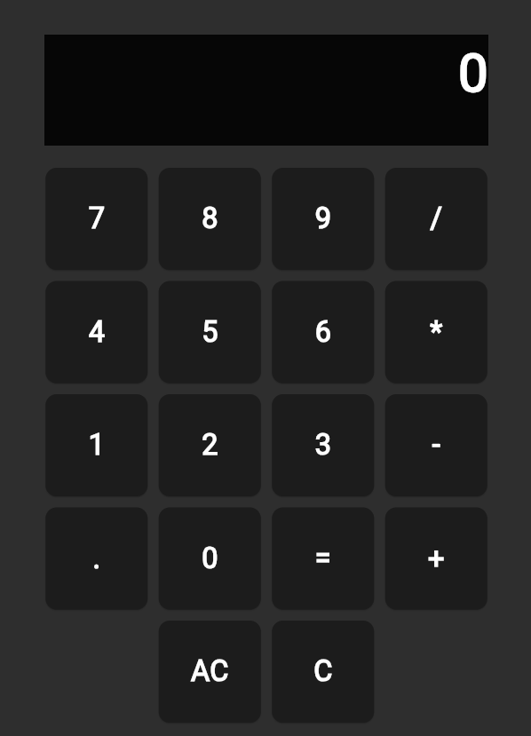

# 🔢 Flutter Web Calculator

A simple, responsive calculator built using **Flutter Web**.  
Designed to run directly in the browser with clean UI and core functionality — no installation needed.

If your using phone close the desktop mode.
> 🚀 [Try the Live Demo](https://shamilslk.github.io/Flutter_Calculator/)

---

## 📸 Screenshot

> *(Add screenshot here if available)*  
> 

---

## ✨ Features

- 🧮 Basic arithmetic operations: addition, subtraction, multiplication, division
- 📱 Responsive UI (works on mobile and desktop browsers)
- ⚡ Fast and lightweight
- 🌐 Hosted using GitHub Pages

---

## 🛠 Built With

- [Flutter](https://flutter.dev)  
- [Dart](https://dart.dev)  
- [GitHub Pages](https://pages.github.com)

---

## 🛡️ License

This project is licensed under the [MIT License](LICENSE).  
You are free to use, copy, modify, and distribute this software, provided that you give appropriate credit to the author.

---

## 📂 How to Run Locally

```bash
# Clone the repo
git clone https://github.com/shamilslk/Flutter_Calculator.git
cd Flutter_Calculator

# Get dependencies
flutter pub get

# Run in Chrome
flutter run -d chrome
